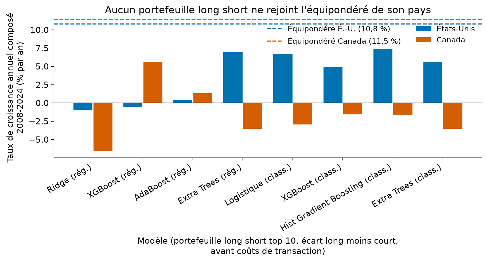
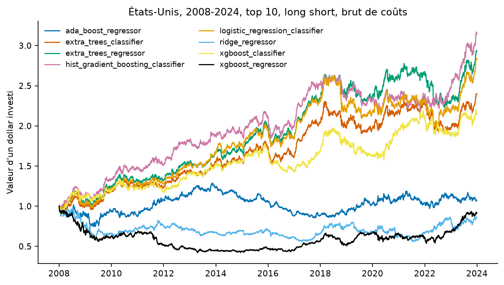
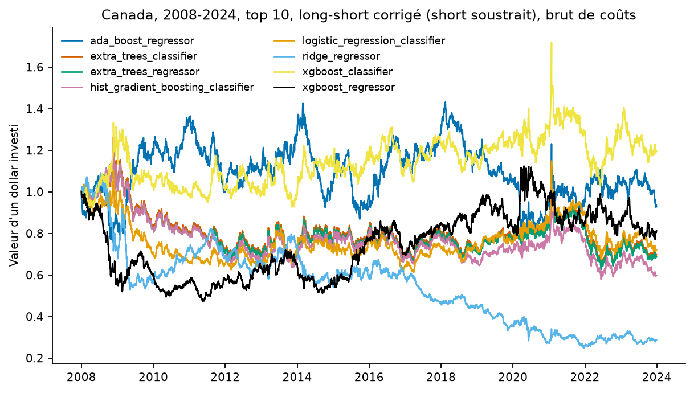
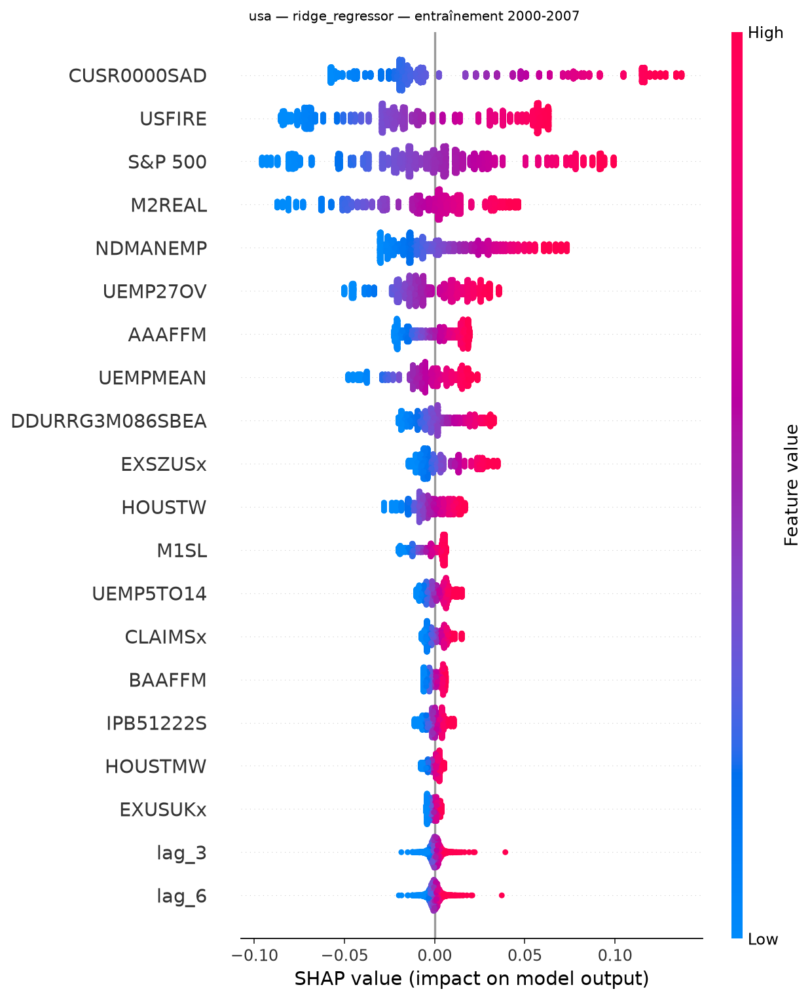

# Prédire les rendements d'actions canadiennes et américaines avec des données macroéconomiques et l'apprentissage machine

Pipeline complet de mon mémoire de maîtrise, *Évaluation empirique d'actifs canadiens par l'apprentissage
automatique* (Guillaume Vaudescal, UQAM, décembre 2024, dir. Philippe Goulet Coulombe et Dalibor Stevanovic),
rendu reproductible en 2026 : environnement figé, ligne de commande, 35 tests, résultats et figures régénérables
à l'identique. Le mémoire complet (PDF, 96 pages) est dans [`reports/`](reports/).

[](https://github.com/Guilou001/04-memoire-uqam-2024/actions/workflows/ci.yml)


**Résultat en une phrase.** Huit modèles d'apprentissage machine, nourris de centaines de variables
macroéconomiques, tentent de prédire chaque mois les rendements de 50 actions américaines et 50 actions
canadiennes de 2008 à 2024 ; les portefeuilles long short construits sur ces prédictions, achat des titres
les mieux classés et pari sur la baisse des moins bien classés, rapportent au mieux **7,4 % par an** aux
États-Unis et **5,6 %** au Canada (ratios de Sharpe 0,80 et 0,39, le rendement gagné par unité de risque
pris), tous sous un simple portefeuille équipondéré, la même somme placée sur chaque titre (10,8 et 11,5 %).
La prédiction de rendements mensuels par la macro est un problème très difficile, et ce dépôt montre
précisément pourquoi.

*English summary.* Full, reproducible pipeline of my MSc thesis: monthly returns of 50 TSX and 50 S&P 500 stocks
predicted with Canadian (LCDMA, 410 series) and US (FRED-MD, 126 series) macro data; eight ML regressors and
classifiers (Ridge, XGBoost, AdaBoost, Extra Trees, and their classification counterparts); top 10 / top 20 /
positive-prediction signals; equal-weight long short portfolios, 2008-2024, walk-forward with monthly refits.
Best long short result: 7.4 % CAGR (Sharpe 0.80, US HistGradientBoosting) and 5.6 % in Canada (XGBoost); all
trail the 10.8-11.5 % equal-weight benchmark. Out-of-sample R² are negative or at best near zero. SHAP
feature-importance figures, pinned environment (uv), CLI, 35 tests. Limits (hyperparameter selection on the
test period, anti-optimal trial retained for regressors, survivor universe, macro alignment) are quantified
in section 8.

## 1. La question posée

Telle qu'énoncée dans l'introduction du mémoire :

> « Dans quelle mesure l'utilisation d'algorithmes d'apprentissage machine linéaire et non-linéaire de régression
> et de classification permet-elle de prédire les rendements d'actifs financiers canadiens, et quelles sont les
> performances de ces portefeuilles construits à partir de ces prédictions, suivant des stratégies longues et
> courtes avec différents signaux, en comparant avec le marché américain ? »

En mots simples : est-ce qu'un algorithme qui observe l'économie (taux d'intérêt, emploi, production, prix) peut
deviner, un mois à l'avance, quelles actions vont monter et lesquelles vont baisser ? Et si on achète les actions
qu'il préfère tout en vendant à découvert celles qu'il aime le moins, est-ce qu'on gagne de l'argent ? Le mémoire
pose la question pour le Canada, un marché peu étudié sous cet angle, et compare avec les États-Unis.

## 2. D'où vient ce projet, et ce qu'il apporte

La finance empirique a longtemps expliqué les rendements avec quelques facteurs linéaires (Fama et French, 1993,
2015). Or les marchés dépendent d'une multitude de variables qui interagissent de façon non linéaire, ce que ces
modèles capturent mal. C'est l'argument de Gu, Kelly et Xiu (2020), qui comparent des dizaines de méthodes
d'apprentissage machine sur 30 000 actions américaines et montrent que les méthodes non linéaires mesurent mieux
les primes de risque. Krauss et al. (2017) construisent des portefeuilles long short sur le S&P 500 avec des
réseaux de neurones et des forêts d'arbres ; Freyberger et al. (2020) et Chen et al. (2021) prolongent cette
littérature. Presque tout ce travail porte sur les États-Unis.

Ce que ce dépôt apporte :

- **Un volet canadien.** Les 410 séries macroéconomiques canadiennes de la base **LCDMA** (Large Canadian
  Database for Macroeconomic Analysis), le recueil qui rassemble et met en forme l'essentiel des statistiques
  macroéconomiques du Canada (Fortin-Gagnon, Leroux, Stevanovic et Surprenant, 2022), appliquées à la
  prédiction de 50 actions du TSX, avec la même méthode que le volet américain, ce qui permet une vraie
  comparaison entre les deux marchés.
- **Une réplication complète et honnête.** Tout le pipeline du mémoire est réexécutable commande par commande,
  chaque chiffre vient d'un fichier de résultats, et les limites sont mesurées plutôt que passées sous silence
  (section 8).
- **Deux implémentations.** Le code de 2024 (`ml_returns_pred`, figé, étiqueté v1.0.0) et une refonte 2026
  (`mlrp`) : mêmes modèles et mêmes réglages, mais prédictions mises en cache et partagées, portefeuille
  vectorisé, exécution parallèle et 35 tests, dont des tests d'équivalence avec le code d'origine
  (voir `docs/V2_ARCHITECTURE.md`).

## 3. Les données

Toutes les données sont libres d'accès et se téléchargent par script (`scripts/fetch_data.py`) ; rien n'est
commité dans le dépôt.

| | Canada | États-Unis |
|---|---|---|
| **Actions** | 50 titres du TSX (depuis la v1.1 : CNQ et CGI remplacent le doublon ENB et le FNB XIU de 2024, un FNB étant un fonds négocié en bourse, un panier de titres coté comme une action), prix Yahoo ajustés | 50 titres du S&P 500 |
| **Macro** | LCDMA, 410 séries mensuelles (1981 →) | FRED-MD, 126 séries mensuelles (1959 →) |
| **Indices de référence** | S&P/TSX composite | S&P 500, NASDAQ |
| **Fréquence** | mensuelle (prix en début de mois) | idem |
| **Entraînement / test** | 2000 → 2007-12, puis 2008-01 → 2024-01 (193 mois) | idem |

Une définition utile. **FRED-MD** (McCracken et Ng, 2016), la base mensuelle de la Réserve fédérale de
Saint-Louis, standard de la recherche macroéconomique américaine ; la LCDMA, définie en section 2, en est
l'équivalent canadien. Sous-périodes étudiées en plus de 2008-2024 : 2008-2012, 2012-2020 et 2020-2024.

## 4. La méthode, pas à pas

1. **Transformer les prix en rendements mensuels.** Le rendement d'un mois, la variation du prix en pourcentage
   entre le début du mois et le début du mois suivant, est ce que les modèles cherchent à prédire.
2. **Apprendre du passé, prédire un mois à la fois.** Chaque modèle s'entraîne sur 2000-2007, prédit janvier 2008,
   puis janvier 2008 rejoint l'entraînement et le modèle, réentraîné, prédit février 2008, et ainsi de suite
   jusqu'en 2024. Cette marche en avant (*walk-forward*) garantit qu'une prédiction n'utilise jamais les rendements
   qui la suivent. Chaque modèle voit, comme variables, les 12 à 24 derniers rendements de chaque titre et toutes
   les séries macro.
3. **Huit modèles, deux familles.** Quatre modèles de **régression** prédisent la valeur du rendement :
   - **Ridge**, une régression linéaire dont les coefficients sont freinés pour éviter le surapprentissage ;
   - **XGBoost**, des arbres de décision construits l'un après l'autre, chacun corrigeant les erreurs du précédent ;
   - **AdaBoost**, une autre famille d'arbres en séquence, qui insiste sur les observations mal prédites ;
   - **Extra Trees**, une forêt d'arbres tirés au hasard puis moyennés.

   Quatre modèles de **classification** prédisent seulement le signe (le rendement sera-t-il positif ?) :
   régression logistique, XGBoost, Hist Gradient Boosting et Extra Trees en version classifieur.
4. **Choisir les réglages sans tricher, ou presque.** Les hyperparamètres, les réglages internes de chaque modèle,
   sont choisis par recherche bayésienne, une exploration qui concentre les essais sur les réglages les plus
   prometteurs (Optuna, 50 essais, graine 123). Deux réserves, mesurées en section 8. D'une part, le mémoire les
   a choisis sur la période de test elle-même. D'autre part, pour les régresseurs, la sélection retient l'essai
   le moins bon de la recherche au sens du R² : l'outil de recherche trie ses essais en ordre croissant et le
   pipeline de 2024 prenait la première ligne. La sélection bride donc les régresseurs au lieu de les avantager ;
   ce comportement est conservé par défaut pour rester fidèle au pipeline de 2024, et l'option `--select-best`
   le corrige.
5. **Construire les portefeuilles long short.** Chaque mois, le portefeuille **achète** (position longue) les
   10 titres aux prédictions les plus hautes et **vend à découvert** (position short) les 10 titres aux prédictions
   les plus basses, à poids égaux de chaque côté. Vendre à découvert, c'est vendre un titre emprunté pour le
   racheter plus tard : on gagne si son prix baisse. Le portefeuille gagne donc si les préférés du modèle font
   mieux que ses mal-aimés, peu importe que le marché monte ou baisse. Trois signaux sont testés : top 10, top 20,
   et « positif » (long sur toutes les prédictions positives, short sur toutes les négatives).
6. **Mesurer.** Rendements quotidiens avec dérive des poids entre deux rééquilibrages mensuels, sans coûts de
   transaction (comme dans le mémoire ; une option `--fee` existe). Métriques : le **TCAC** (taux de croissance
   annuel composé, le rendement annuel moyen), le **ratio de Sharpe** (le rendement gagné par unité de risque
   pris ; au-dessus de 1, c'est bon), la **perte maximale** (la pire baisse depuis un sommet), le **R² hors
   échantillon** (la part des variations des rendements que les prédictions expliquent) et le test de
   Pesaran-Timmermann (le signe est-il prédit mieux que le hasard ?).

## 5. Les résultats

Portefeuilles long short, signal top 10, 2008-01 → 2024-01, sans coûts, TCAC en années civiles. Tous les chiffres
viennent de `results/v2/metrics.csv`, régénérable par une commande (section 7).

| Modèle | É.-U. TCAC | É.-U. Sharpe | É.-U. perte max. | Canada TCAC | Canada Sharpe | Canada perte max. |
|---|---:|---:|---:|---:|---:|---:|
| Ridge (rég.) | −0,9 % | 0,00 | −44,6 % | −6,6 % | −0,29 | −75,8 % |
| XGBoost (rég.) | −0,6 % | 0,02 | −57,9 % | 5,6 % | 0,39 | −35,4 % |
| AdaBoost (rég.) | 0,4 % | 0,10 | −33,6 % | 1,3 % | 0,16 | −46,2 % |
| Extra Trees (rég.) | 6,9 % | 0,76 | −19,6 % | −3,5 % | −0,13 | −56,8 % |
| Logistique (class.) | 6,7 % | 0,72 | −24,8 % | −2,9 % | −0,10 | −51,3 % |
| XGBoost (class.) | 4,9 % | 0,52 | −20,4 % | −1,5 % | −0,01 | −48,2 % |
| **Hist Gradient Boosting (class.)** | **7,4 %** | **0,80** | −18,1 % | −1,6 % | −0,01 | −48,0 % |
| Extra Trees (class.) | 5,6 % | 0,63 | −17,4 % | −3,5 % | −0,13 | −56,8 % |

Points de comparaison sur la même période : **S&P 500 : 7,6 %** (Sharpe 0,46) ; équipondéré des 50 titres
américains : 10,8 % (0,64) ; **composite TSX : 2,6 %** (0,24) ; équipondéré des 50 titres canadiens : 11,5 % (0,78).
Jusqu'au 2026-08-28, ce dépôt affichait ici le NASDAQ sous l'étiquette « S&P 500 » (11,5 %, Sharpe 0,59), un
artefact hérité du pipeline de 2024, et un équipondéré qui sautait son premier mois ; les deux sont corrigés
(section 9 et `docs/VERIFICATION_2026-08-23.md`, addendum du 2026-08-28).

Comment lire ce tableau, en trois constats :

- **Aucun portefeuille long short ne bat le simple équipondéré.** Le meilleur modèle américain rapporte 7,4 % par
  an, l'équipondéré 10,8 % avec moins de complexité. Au Canada, un seul modèle ressort (XGBoost régresseur, 5,6 %,
  Sharpe 0,39), toujours sous l'équipondéré à 11,5 %. En revanche, les
  pertes maximales des long short sont bien plus faibles (−18 % contre −50 % environ pour les indices en 2008-2009) :
  c'est l'intérêt d'une stratégie couverte, elle amortit les krachs.
- **Les R² hors échantillon sont négatifs ou voisins de zéro.** Cinq des huit moyennes de régression sont négatives (de
  −1,28 pour le Ridge canadien à −0,10, colonne `r2_oos_average` de `results/v2/metrics.csv`) ; les trois
  positives plafonnent à +0,03 (XGBoost canadien), et deux d'entre elles viennent des Extra Trees, qui
  prédisent une constante (constat suivant). Les prédictions expliquent donc au mieux une part infime des
  rendements ; prédire le niveau d'un rendement mensuel avec la macro seule est, sur cet échantillon, hors de
  portée de ces modèles.
- **Attention aux égalités de rangs.** Plusieurs modèles prédisent la même valeur pour tous les titres à la
  plupart des dates (mesuré dans `results/v2/tables/prediction_ties.csv` : 100 % des dates pour Extra Trees en
  régression, dont les hyperparamètres retenus élaguent chaque arbre jusqu'à une feuille unique ; plus de 90 %
  pour Extra Trees classifieur ; 58 à 95 % pour plusieurs classifieurs canadiens, dont les prédictions sont des
  classes 0/1). Quand toutes les prédictions sont égales, le « top 10 » retient simplement les dix premiers titres
  dans l'ordre des colonnes : la performance de ces lignes mesure alors un portefeuille quasi fixe, pas la
  clairvoyance du modèle. Les lignes Ridge, XGBoost et AdaBoost en régression, elles, classent réellement les titres.



Comment lire cette figure : chaque paire de barres est un modèle ; la hauteur donne le TCAC 2008-2024 de son
portefeuille long short top 10, en pourcentage par an (bleu : États-Unis, orange : Canada) ; les lignes
pointillées marquent l'équipondéré de chaque pays (10,8 et 11,5 %, `results/v2/metrics.csv`). Aucune barre
n'atteint la ligne de son pays, et six barres canadiennes sur huit sont sous zéro. La figure est produite par
`scripts/make_summary_figure.py`.

| États-Unis | Canada |
|---|---|
|  |  |

Comment lire la figure américaine : chaque courbe suit la valeur d'un dollar investi début 2008 dans un
portefeuille long short top 10, sans coûts, sur une échelle linéaire ; une courbe sous 1 signifie que le
portefeuille a perdu de l'argent depuis le départ (Ridge et XGBoost en régression y passent l'essentiel de la
période). La courbe pointillée grise est l'équipondéré de référence (10,8 % par an) : elle finit au-dessus de
toutes les autres.

Comment lire la figure canadienne : même construction, un dollar investi début 2008, courbe sous 1 = perte,
échelle linéaire. L'équipondéré en pointillés gris (11,5 % par an) domine tous les long short à partir de
2012 ; seuls le XGBoost régresseur (2,40 $ à l'arrivée) et l'AdaBoost (1,23 $) finissent au-dessus de leur
dollar de départ, et le Ridge termine à 0,33 $ (colonne `Cumulative_Returns` de `results/v2/metrics.csv`).
Le détail par signal et le mode de réplication 2024 sont dans `results/v2/figures/`.

## 6. Ce que les modèles regardent : l'analyse SHAP

Les valeurs **SHAP** (Lundberg et Lee, 2017) mesurent, pour chaque prédiction, la contribution de chaque variable :
combien cette variable a poussé la prédiction vers le haut ou vers le bas. C'est la réponse à la question « le
modèle est une boîte noire, mais que regarde-t-il ? ».



Comment lire cette figure : chaque point est une observation (un titre, un mois de la période d'entraînement) ;
sa position horizontale dit de combien la variable a déplacé la prédiction, sa couleur dit si la variable était
haute (rouge) ou basse (bleue) ce mois-là. Pour le Ridge américain, quatre séries de FRED-MD dominent :
CUSR0000SAD, l'indice des prix à la consommation des biens durables ; USFIRE, l'emploi dans la finance,
l'assurance et l'immobilier ; le niveau de l'indice S&P 500 lui-même ; et M2REAL, la masse monétaire M2 en
dollars constants. Suivent NDMANEMP (l'emploi manufacturier des biens non durables) et UEMP27OV (les chômeurs
depuis 27 semaines et plus) : le modèle lit surtout les prix, l'emploi et le marché boursier. La version
« classement » (moyenne des contributions absolues) est dans les fichiers `bar_*.png`.

Les figures des sept modèles couverts, pour les deux pays, sont dans `results/v2/figures/shap/` et se régénèrent
par `uv run mlrp shap --country both`. Deux limites honnêtes : AdaBoost n'a pas d'explicateur SHAP adapté, et les
figures Extra Trees affichent des valeurs toutes nulles, ce qui est exact puisque le modèle retenu prédit une
constante (section 5) : une figure vide qui dit la vérité vaut mieux qu'une figure pleine qui la masque.

## 7. Reproduire

```bash
uv sync --locked --all-extras                     # Python 3.12, versions figées (uv.lock)
uv run pytest                                     # 35 tests, sans données externes
uv run python scripts/fetch_data.py               # prix Yahoo ; déposer macro_data.csv (LCDMA) et Fred-MD.csv
uv run mlrp run --country both --period 2008-2024 --models thesis --signals all --jobs 8
uv run mlrp table --country usa --period 2008-2024
uv run mlrp figures --country usa --period 2008-2024 && uv run mlrp shap --country usa
```

Durées mesurées (Apple M2, 8 processus) : l'exécution complète ci-dessus (8 modèles, 2 pays, 3 signaux) prend
**2 h 40**, dominée par les réentraînements mensuels ; un seul modèle Ridge prend environ une minute. Les
prédictions sont mises en cache dans `data/cache_v2/` : les relances sont immédiates, et le cache s'invalide de
lui-même si les données changent. macOS : xgboost et lightgbm demandent `libomp` (`brew install libomp`).

Le code de 2024 reste exécutable à l'identique : `uv run ml-returns-pred run --strategy ridge_regressor
--country usa --signal top --top 10 --period 2008-2024`.

## 8. Limites et biais (avec leur statut)

| Limite | Statut |
|---|---|
| Hyperparamètres choisis sur la période de test (fuite de sélection) | reconnu ; validation purgée prévue dans `memoire-2.0` |
| Pour les régresseurs, la sélection retient l'essai le moins bon de la recherche bayésienne (l'outil trie ses essais en ordre croissant, le pipeline de 2024 prenait la ligne 0, y compris pour un R² à maximiser) ; conservé par défaut pour la fidélité à 2024 | mesuré : R² retenu −741,0 contre −81,3 au meilleur essai (Ridge É.-U.) et −20,9 contre −0,90 (Ridge Canada), `data/cache_v2/*/tuning_results.parquet` ; correction par l'option `--select-best` |
| Variables macro alignées un mois en avance sur le rendement prédit (convention du code de 2024) | mesuré : en alignement temps réel, le TCAC du Ridge américain passe de −0,9 % à −3,3 % et le R² moyen de −0,40 à −0,46 (`scripts/check_exog_alignment.py`) ; l'ordre de grandeur des conclusions ne change pas |
| Prédictions identiques pour tous les titres à la plupart des dates pour plusieurs modèles (classement alphabétique de fait) | mesuré par modèle : `results/v2/tables/prediction_ties.csv` et `scripts/check_prediction_ties.py` |
| Univers figé de titres survivants (biais de survie) ; celui de 2024 comptait 49 titres canadiens dont le FNB XIU.TO, la v1.1 passe à 50 vrais titres (CNQ, CGI) | reconnu ; univers point-in-time prévu dans `memoire-2.0` |
| Coûts de transaction à zéro, poids égaux, rééquilibrage mensuel | reconnu ; option `--fee` disponible |
| Données macro en millésime final (les révisions ne sont pas simulées) | reconnu |
| Prix Yahoo ajustés révisés dans le temps (le volet canadien retéléchargé diffère un peu de 2024) | mesuré (corrélation 0,96 des prévisions) |

## 9. Notes de réplication (pour qui veut retrouver les chiffres de 2024)

Le mode par défaut de `mlrp` applique la stratégie long short décrite dans le mémoire (short soustrait,
rééquilibrage au premier jour de bourse du mois). Le mode `--modes as_published` reproduit, lui, le code de 2024
à l'identique, y compris ses conventions propres : la contribution du short y est additionnée au lieu d'être
soustraite (les tableaux du mémoire décrivent donc des portefeuilles longs des deux côtés, à 200 % d'exposition
brute), un rééquilibrage tombant un week-end est sauté, et le TCAC publié utilisait une convention en jours de
bourse qui le sous-estime. L'équivalence avec le code d'origine est testée : mêmes hyperparamètres Optuna,
prédictions à 2,8 × 10⁻⁷ près, poids identiques, rendements quotidiens à 1,2 × 10⁻¹⁶ près
(`scripts/check_v2_equivalence.py`). Deux chiffres de référence diffèrent en revanche des tableaux de 2024
depuis le 2026-08-28, volontairement : l'équipondéré détient désormais son premier mois (le calcul antérieur
le sautait, son TCAC 2008-2024 passe de 11,1 à 10,8 % aux États-Unis et de 11,9 à 11,5 % au Canada), et
l'indice américain est le vrai S&P 500 (le pipeline de 2024 chargeait le NASDAQ sous cette étiquette, 11,5 %
affiché contre 7,6 % réel). Le détail complet est dans `docs/VERIFICATION_2026-08-23.md`. Les figures
SHAP archivées de 2024 (`results/figures/`) moyennaient en outre les contributions entre les titres, ce qui les
écrasait vers zéro ; celles de `results/v2/figures/shap/` empilent les observations, comme le veut l'usage.

## 10. Arborescence

```
memoire-uqam-2024/
├── src/ml_returns_pred/      v1 : code du pipeline (2024), figé pour la réplication
├── src/mlrp/                 v2 : config, data, models, portfolio, metrics, runner, report, explain, cli (2026)
├── config/                   YAML : réglages par modèle et espaces de recherche (2024)
├── docs/                     audit (VERIFICATION_2026-08-23.md) et architecture v2 (V2_ARCHITECTURE.md)
├── scripts/                  fetch_data, check_v2_equivalence, check_exog_alignment, check_prediction_ties, …
├── tests/                    pytest (35) : long short, rangs, dérive, métriques, cache, équivalence v1/v2
├── results/                  archive_2024/ (sorties d'origine), figures/ (PNG 2024), tables/,
│                             v2/ : metrics.csv, rendements quotidiens, figures, figures SHAP, tables
├── reports/                  mémoire (PDF) et résumé officiel
├── data/raw_data/            non versionné : prix Yahoo, LCDMA, FRED-MD (voir data/raw_data/README.md)
└── workdir/                  répertoire de travail du code historique
```

## 11. Crédits, licence, citation

Code et résultats : Guillaume Vaudescal. Infrastructure initiale du pipeline en 2024 (lecture de configuration,
gestion de fichiers, structure des modules) : Thomas Vaudescal. Données : LCDMA (Fortin-Gagnon, Leroux, Stevanovic et
Surprenant, 2022, *Canadian Journal of Economics*), FRED-MD (McCracken et Ng, 2016, *JBES*), Yahoo Finance.
Bibliothèques : skforecast, scikit-learn, Optuna, quantstats-lumi, shap.

Code sous licence MIT ; texte du mémoire et figures sous CC BY 4.0. Citation : voir `CITATION.cff`.
